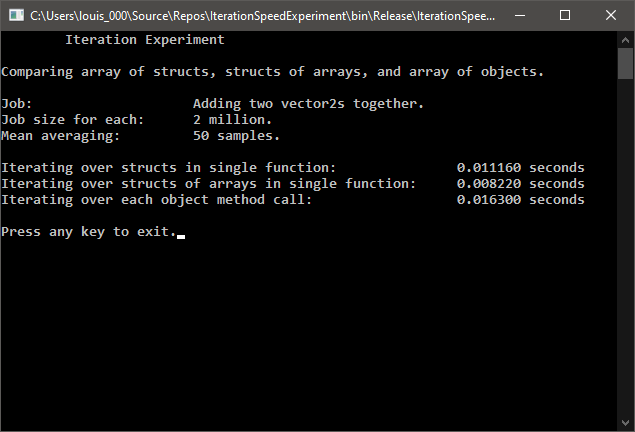

# Iteration Speed Experiment

This is a quick comparison of execution speeds when applying the same iterative operation on different data structures representing a collection of 2x1 vectors. This is to investigate the impact of data access methods on execution speed within a compiled C++ release binary, such as in being able to leveraging efficient CPU and memory use. 

The data structures used were; 

An array of structs each containing an x and y value:

```cpp
typedef struct
{
    double x;
    double y;
}Vector2_Struct;
```

 A struct of arrays each containing xs and ys:

```cpp
typedef struct
{
    double xs[JOB_LIST];
    double ys[JOB_LIST];
}Vector2_StructOfArrays;
```

 And an array of objects each containing an x and y value, and a method to perform on operation on them:
 
 ```cpp
 class Vector2_Object
{
private:
    double x;
    double y;
public:
    void add(double x, double y);
    Vector2_Object():
        x(0.0),
        y(0.0)
        {};
};
 ```

As seen in the screenshot, over an average of 50 samples, calling a single function with a loop inside, to add a double value to an array of Vector2 structs, is 1.46 times faster as calling each Vector2 object from an array to do the same job. Using a similar function to add to a struct of an arrays with xs and ys proves to be 1.98 times faster.



The base speed of the object method call was expected to be derived from pushing and popping from the program call stack with the explicit parameters and the implicit object memory address. Additionally, the x and y variables would be accessed in different memory locations in which data caching would be limited. Instruction caching might have been limited too given that the addition operation is performed after distinct function calls. 

With this in mind, it was expected that the array of structs would perform better given that instruction caching would be more likely. This is because of the looping on the addition operator between each array element. However, each element comprises of two double values which would cost an additional access step to the x and y values on every iteration.

The struct of arrays performed best as expected since this is most likely to have used instruction and data caching more than the previous methods. This is because the addition operator is called in a loop and the data would have been accessed with individual double values aligned in memory. Perhaps this could have been improved by adding to all x values before proceeding to the y values, but it is possible that both were stored efficiently despite this. Neverthless, the improvement over the array of structs was more than expected. 